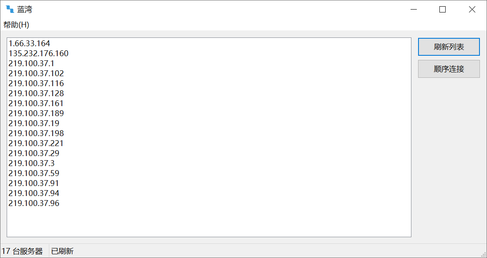

# 蓝湾

蓝湾是一个 L2TP/IPsec 服务器测试程序

---

## 屏幕截图

---

## 下载地址

👉 [点击这里下载最新版本](https://github.com/liangshengyong/LanWan/releases/latest)

---

## 使用方法

1. 下载并解压压缩包
2. 双击 `蓝湾.exe` 启动程序
3. 点击 `刷新列表` 按钮获取最新服务器列表
4. 点击 `顺序连接` 按钮对服务器列表中的服务器依次进行连接
5. **首次连接会请求管理员权限**，用于配置 L2TP/IPsec 所需的安全参数

---

## 免责声明

- 本程序由 AI 自动生成，仅用于学习和技术研究
- 使用者请自觉遵守当地法律法规，作者不对使用后果承担任何责任

---

## 许可证

- Source code is licensed under the **MIT License**
- Prebuilt binaries are provided for convenience, **without any warranty**
